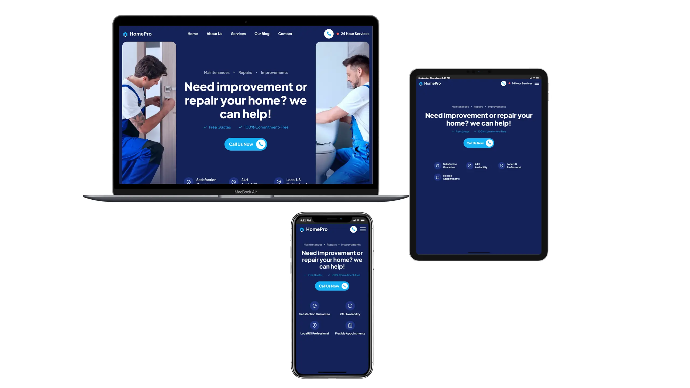

# Home Pro

**Role:**  
Front-End Developer | Responsive Design | JavaScript Interactivity | Custom UI Components  

🌐 [View Live Project](https://oleksandrmul.github.io/homepro/)

---

## Overview  
Built a **responsive one-page landing website** for a home improvement business providing reliable repair and renovation services. The project emphasizes professionalism, trust, and usability through interactive UI elements and a clean, business-oriented design.  

---

## Key Achievements  
- ✅ Implemented **smooth scroll navigation, hover effects, and Swiper slider** for modern interactions.  
- ✅ Built **custom JavaScript spoilers (accordions)** to organize content, improve usability, and save space.  
- ✅ Added a **JavaScript-powered burger menu** for mobile navigation.  
- ✅ Developed a **custom validation system** for the subscribe form using JavaScript and CSS, preventing empty or incorrect submissions.  
- ✅ Ensured full **responsive adaptation across all devices**.  
- ✅ Applied **semantic HTML5, SCSS structuring, and mobile-first approach** for reliability and performance.  

---

## Outcome  
Delivered a **professional and adaptive landing page** tailored for a home improvement service provider. Interactive spoilers, form validation, and smooth animations create a seamless experience while reinforcing the business’s credibility.  

---

## Conclusions  
This project demonstrates how thoughtful **UI interactions, space-saving components, and reliable validation systems** can enhance a service-focused landing page. From custom-built spoilers to form validation and responsive layouts, every feature was designed with usability and trust in mind.  

If you’re looking for a developer who can deliver **professional, interactive, and business-ready websites**, I’d be excited to collaborate on your next project 🛠️✨.  
